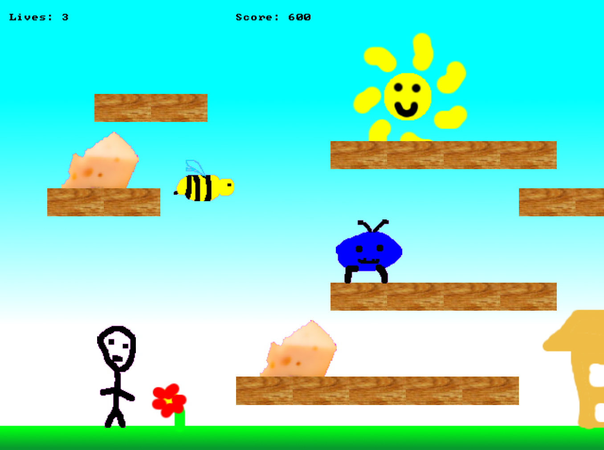

# Oily-Bob-SDL

Oily Bob is a bright, cheerful platform game using C++ and SDL 3.  

It's a very simple platform game. Gather the cheese to progress to the next level, and dodge the bad guys.  

### Controls  

Joypad or keys:
Left and right arrows (or pad) to move. Space (or buttons) to jump. Tap buttons to fall through platforms.

### Status  

This is an SDL3 conversion of an older project: 
[Oily Bob Original](https://github.com/Jamibaraki/oily-bob)

Features from the original are now in, along with a few minor improvements:

* Code organization improvements over single file original
* An ending
* Even better graphics

Possible future improvements:  

* Sprite animation
* Level and death transitions
* New Levels
* Persistent High Scores
* Entity classes reworked and explicit sprite handling class used
* Better sound management

### Building  

Requires **SDL 3**.

**Example (MinGW / g++):**
```bash
g++ *.cpp -o oily-bob -lSDL3
```

### Running

Runs by opening the .exe file.

Requires SDL3.dll in the runtime folder, along with the **contents** of the asset folder, so the runtime folder with contain:
* the exe
* SDL3.dll
* graphics folder, containing the graphics
* sound folder, containing the sounds

### Feature List

* Four levels of cheese-tastic platforming action!
* Original Graphics and Sounds!!
* Butter-smooth scrolling!!!
* High Score Table!!!!
* Luxurious background gradients!!!!!
* Bert the worm!!!!!!!

### Screenshot  


